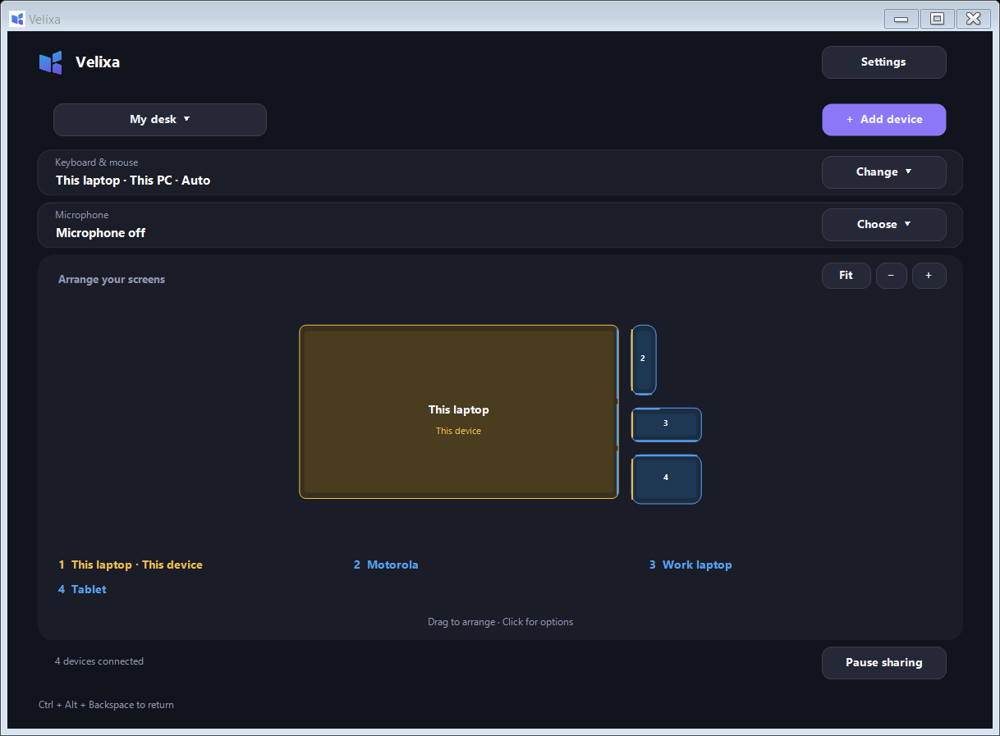

## Velixa-Input sharing

Share a keyboard, mouse, clipboard, files and microphone across your local desk. Windows PCs can control Windows and Android devices without an account or cloud relay.

**[Download Windows and Android 0.5.1](https://github.com/akasumitlamba/Velixa/releases/tag/v0.5.1-preview)** · [License](LICENSE) · [Testing](TESTING.md) · [Contributing](CONTRIBUTING.md)



## Set up your desk

1. Install the Windows EXE on each PC. Install the APK on Android.
2. On one Windows PC, choose **Create my desk**, then **Add device**. This PC coordinates the desk and must stay awake.
3. On another Windows PC, find the desk and enter its four-digit pairing code.
4. On Android, enable Velixa continuity in Accessibility, then scan the QR code shown under **Add device > Android** on the PC.
5. Arrange the screens to match your physical desk. Move the pointer across a touching edge to switch devices.

Upgrade all devices to 0.5.1 for this release. Existing pairings are retained. Windows requires .NET Framework 4.8; Android requires Android 8 or later. The Windows installer is unsigned, so Windows may show an unknown-publisher warning. The APK uses the project's existing release signing identity.

Device boxes show large numbers. The numbered name list below the arrangement uses the same shared order on Windows and Android. Names on Android wrap to fit the available width.

## Everyday controls

- **Automatic input** lets you use any connected PC's keyboard or mouse without a switching popup. Choose a fixed source from **Change** if preferred.
- **Ctrl + Alt + Backspace** returns the pointer to the current source PC.
- Closing or minimizing the window keeps Velixa running in the tray. Double-click its tray icon to reopen; choose **Quit** to stop.
- Use the desk-name menu to create, rename, switch or delete saved arrangements. Up to 12 layouts share the same paired devices and coordinator.
- Click a device or its name to put it to sleep in Velixa, wake it, adjust its size, or forget it. Sleep keeps pairing. Forget removes it from all saved layouts and requires pairing again.
- Screen shapes retain their proportions and snap without overlap. Multiple smaller screens can share separate segments of any larger screen's edge.
- Gold identifies the device you are using; other devices are blue. Full names beneath the arrangement remain readable even for narrow phone screens. Use **+**, **−** and **Fit** to change the view.

## Clipboard and files

Windows text and image clipboard changes are shared with available Windows peers. Settings can disable clipboard sharing or incoming files. Clipboard payloads are limited to 16 MB.

Drop files directly onto the destination Windows screen card. They arrive in **Downloads/Velixa**. A bottom-right panel shows progress, speed and cancellation. Existing files are not overwritten; completed file content is verified with SHA-256. Dropping onto empty space sends nothing.

Folder transfers, Android file/clipboard sharing and direct Explorer-to-Explorer drag-and-drop are not included.

## Microphones

The microphone menu lists available inputs with their source device, such as **USB microphone · Model name (VOSTRO)** or **System microphone (Motorola)**. Hardware names come from the operating system; device-type labels use the information available from its drivers. Android combines built-in microphone routes into one system microphone and excludes telephony and virtual audio routes. Distinct connected USB, headset and Bluetooth microphones remain selectable. Lists refresh approximately every five seconds.

### Share a Windows microphone

1. On each receiving PC, open **Settings > Microphone sharing**, enable incoming audio, and select the receiving output.
2. On the source PC, choose a microphone from the main microphone menu. One capture stream is sent to all available compatible Windows receivers that accept it.
3. To select that microphone from another PC instead, first enable **Allow paired PCs to request this PC's microphone** on the source. This permission lasts for the current app session.
4. Choose **Microphone off** to stop sharing or receiving on that PC.

### Use an Android microphone on PCs

Open Velixa on Android and tap **Enable microphone sharing to PCs**. Grant microphone permission. A foreground notification remains visible and provides Stop. Choose the phone's input from the microphone menu on a PC with incoming audio enabled. Other available Windows receivers can accept the same stream.

Android sends microphone audio only; it does not play a Windows microphone into phone calls. This app does not emulate a Bluetooth headset or replace Android's telephony microphone. USB/Bluetooth inputs already exposed by the operating system may be listed; routing depends on the device and driver.

### Select shared audio in Teams, Zoom or another Windows app

A normal Windows application cannot create a system-wide microphone endpoint by itself. Install a virtual audio cable separately on each receiving PC if you need this:

- In Velixa, select the cable's playback endpoint, such as **CABLE Input**, as the receiving output.
- In the calling/recording app, select the cable's recording endpoint, such as **CABLE Output**, as its microphone.

[VB-CABLE setup](https://vb-audio.com/Cable/) is one option and has its own license. No virtual audio driver is bundled. Selecting speakers/headphones instead plays the stream aloud. On the microphone's own PC, choose the actual hardware input directly in your calling app. Audio is streamed, not saved to disk by Velixa.

## Privacy and networking

Pairing creates separate credentials for each device. Windows uses DPAPI and Android uses Android Keystore-backed storage. TLS connections verify the paired coordinator certificate; the coordinator authenticates each reconnecting device. Pairing codes are short-lived and rate-limited, and QR tokens are single-use.

The app uses TCP 37128 and UDP 37129 on your LAN. Windows firewall rules allow the local subnet on Private networks. Guest Wi-Fi isolation or corporate firewalls may prevent discovery. Device names and IDs are visible in LAN discovery. Clipboard/file/audio content travels over the paired encrypted connection. No account, cloud relay, advertising or input logging is required.

Android camera permission is used only for QR scanning. Microphone permission is used only for the user-enabled microphone service. Camera sharing is not included.

## Platform boundaries

Android input is replayed through Accessibility, with its operating-system limits. Android 8–12 also needs the included Velixa keyboard for typing. Some devices require allowing restricted settings for sideloaded Accessibility services. No ADB, root or Shizuku is required for normal use.

Windows secure desktops, login screens and elevated applications are outside this non-elevated app's control. Each Windows machine's monitors are treated as one combined desktop. The coordinator must remain awake; automatic coordinator migration is not implemented.

Automated validation does not establish compatibility with every physical PC, phone, microphone, driver or calling app. See [test coverage and remaining acceptance checks](TESTING.md).

## Build from source

On Windows, install PowerShell 7, .NET Framework 4.8, Inno Setup 6, JDK 17, and an Android SDK with platform 35 or later plus current stable build-tools. Put Java tools on PATH. Dependencies and their notices are included in `deps/`.

```powershell
./build.ps1 -AndroidSdk "C:/path/to/Android/Sdk"
# Windows only:
./build.ps1 -WindowsOnly
# Automated Windows QA:
./tests/run-tests.ps1
```

Artifacts are written to `dist/`. Android signing keys are created or reused under `%LOCALAPPDATA%/Velixa/build-signing`, outside the repository, with the password protected by DPAPI. Keep that directory private and backed up if you maintain your own Android releases; a different signing key cannot upgrade the official APK in place.

Production settings live under `%LOCALAPPDATA%/Velixa`. Test harnesses require `TESTING` and an explicit isolated `VELIXA_TEST_DATA` directory; tests use different network ports and refuse the production settings path. Preview and self-test app modes also use isolated storage.

## License

Velixa is licensed under the **MIT License**: you may use, modify, redistribute and sell it, including commercially, while retaining the copyright and permission notice. It is provided without warranty. Third-party dependencies retain their own licenses, listed in [third-party notices](assets/THIRD-PARTY-NOTICES.txt). External audio drivers are not part of this project.
