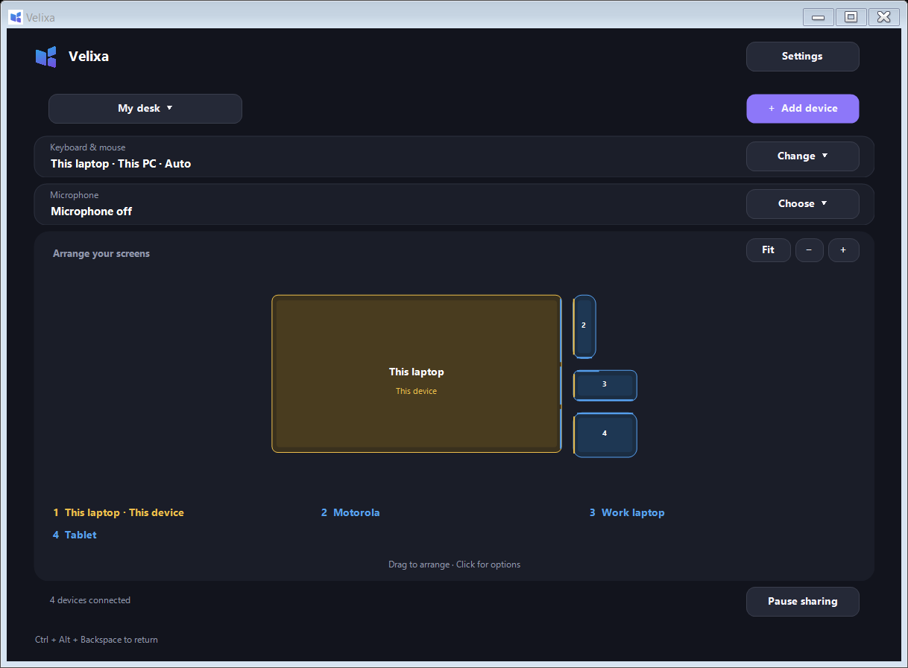

# Velixa

### One keyboard and mouse. Every screen on your desk.

Velixa lets Windows PCs share a keyboard, mouse, clipboard, files, and microphones across a local desk. Move the pointer across the edge of one screen to control another Windows or Android device, with no account and no cloud relay.

[](https://github.com/akasumitlamba/Velixa/releases/tag/v1.2.1)
[](https://github.com/akasumitlamba/Velixa/releases/tag/v1.2.1)
[](LICENSE)



## Why Velixa?

- **Seamless control:** move naturally between devices by crossing a screen edge.
- **Local by design:** traffic stays on your LAN over authenticated, encrypted connections.
- **No account required:** no sign-in, subscription, advertising, or cloud relay.
- **Flexible desk layouts:** arrange screens to match your physical setup and save up to 12 layouts.
- **More than input sharing:** sync Windows clipboards, transfer files, and route microphone audio between supported devices.

## Platform support

| Capability | Windows | Android |
| --- | :---: | :---: |
| Receive keyboard and mouse input | Yes | Yes |
| Act as an input source | Yes | No |
| Text and image clipboard sharing | Yes | Not yet |
| File transfer | Yes | Not yet |
| Share microphone audio | Yes | Yes |
| Receive microphone audio | Yes | No |

> [!NOTE]
> Velixa 1.2.1 bundles optional VB-CABLE setup for shared microphones, with matching Windows and Android versions. It includes receiver-selected microphones, native Windows touchpad gesture forwarding, corrected edge feedback, and simpler controls. Existing pairings are retained. Offline reconnection stops after three attempts; use Retry connection when the other PC is back. Pause input, microphone selection, and Disconnect stay available across desk screens. Offline device removal is saved locally and synchronized when the coordinator returns.

## Download

| Download | Use |
| --- | --- |
| [Windows installer](https://github.com/akasumitlamba/Velixa/releases/download/v1.2.1/Velixa-1.2.1-Windows-Setup.exe) | Install Velixa on a Windows PC. |
| [Windows portable ZIP](https://github.com/akasumitlamba/Velixa/releases/download/v1.2.1/Velixa-1.2.1-Windows-Portable.zip) | Extract the complete folder and run `Velixa.exe`. Keep the included dependencies beside it. |
| [Android APK](https://github.com/akasumitlamba/Velixa/releases/download/v1.2.1/Velixa-1.2.1-Android.apk) | Install or update Velixa on an Android device. |
| [SHA-256 checksums](https://github.com/akasumitlamba/Velixa/releases/download/v1.2.1/SHA256SUMS-1.2.1.txt) | Verify the downloaded files. |

Windows requires .NET Framework 4.8. The installer is unsigned, so Windows may display an unknown-publisher warning. Android requires Android 8 or later; the APK retains the project's existing signing identity for upgrades.

See the [1.2.1 release notes](https://github.com/akasumitlamba/Velixa/releases/tag/v1.2.1). This update includes the optional VB-CABLE driver package. Hardware-specific validation limits are documented in TESTING.md.

### Automatic updates (1.2.1 and later)

Windows and Android check the official GitHub latest-release endpoint once per app process launch. Only a newer stable version is eligible; drafts, prereleases, and downgrades are ignored. The matching installer/APK downloads in the background and must match the release asset's SHA-256 digest. Assets without a digest are skipped. Android additionally verifies the package identity, signing certificate, and increasing version code.

After download, choose **Install** to proceed or **Later** to keep using the current version. Windows opens setup and exits Velixa after confirmation; approve Windows elevation if requested, then reopen Velixa after installation. Android opens its system installer and may first ask you to allow installation from Velixa. No update is installed without confirmation. A cancelled or unavailable update can be offered again on the next process launch. Offline checks fail quietly and do not interrupt local desk sharing.

Update checks contact GitHub over HTTPS; desk input and sharing remain on the local network. Release maintainers must publish matching `Velixa-X.Y.Z-Windows-Setup.exe` and `Velixa-X.Y.Z-Android.apk` assets, use a stable `vX.Y.Z` tag, retain Android's signing identity, and increase its version code. Local builds are not automatically published.

## Quick start

1. Install the Windows app on each PC and the APK on each Android device.
2. On one Windows PC, select **Create my desk**, then **Add device**. This PC becomes the coordinator and must remain awake.
3. On another Windows PC, find the desk and enter the four-digit pairing code.
4. On Android, enable Velixa continuity in Accessibility, then scan the coordinator's QR code or enter its local IP address and four-digit pairing code.
5. Drag the screen cards into the same arrangement as your physical devices.
6. Move the pointer across a touching screen edge to take control of the next device.

If a pairing code expires, select **New pairing code** in the Windows pairing dialog. Both devices must be on the same reachable local network.

## Using your desk

### Windows desk controls

The desk canvas fills the main area. The right sidebar contains three current-PC switches: **Media sharing**, **Clipboard sharing**, and **File sharing**. Click a screen card to adjust that device's size, disconnect it temporarily, reconnect it, or remove it from the current desk. The bottom controls choose this PC's mouse/keyboard source and physical microphone/speaker.

- **Automatic input** lets connected Windows PCs become the active keyboard/mouse source. Choose a fixed source from the hardware controls.
- Press **Ctrl + Alt + Backspace** to return the pointer to the current source PC.
- Minimize keeps Velixa in the taskbar. The window's **X** hides it to the system tray. **Quit app** asks for confirmation and stops sharing.
- The **Desks** menu creates, renames, switches, and deletes saved desks. Each desk remembers its own members, positions, sizes, and temporarily disconnected devices. Add a saved device through **Add device** without pairing again.
- Removing a device affects the selected desk. Temporary disconnect preserves its position as a thin placeholder; waking it restores the full screen card. This does not power on a physically sleeping PC.
- Use **+**, **−**, and **Fit** at the bottom-right of the canvas.
- Saved pairings automatically retry when a device becomes reachable. The desk's coordinator must be running. Explicitly disconnected devices remain disconnected until resumed.

### Android layout

Android uses the same navy-and-purple theme and logo as Windows. Setup shows **Enable continuity**, followed by **Scan QR code** or **Connect with code**. Code pairing uses the PC's local IP address and four-digit code. Once paired, the desk shows numbered screens with matching device names: drag a screen to arrange it, or tap it for input-sharing and size options.

The microphone card appears after continuity is enabled and the device is paired. Starting microphone sharing requires a live connection; stopping an active service remains available. **Disconnect this device** asks for confirmation. **Controls & help** explains mouse mappings and the return shortcut.

Android 8–12L also shows **Keyboard setup** with controls to enable and select the Velixa keyboard. Your normal touchscreen input remains local.

### Clipboard and files

Text and image clipboard changes are shared between available Windows devices. The sidebar switches control clipboard and file sharing in both directions. Clipboard payloads are limited to 16 MB.

To transfer files, drop them onto the Velixa panel in the bottom-right corner of any Windows monitor, even while the main window is hidden. With one connected Windows PC, sending starts immediately; with multiple PCs, choose the destination from the menu. You can still drop files onto the destination Windows screen card. Transfers arrive in **Downloads/Velixa**; open it from the top-right menu's **Open received files**. Corner panels on both PCs show progress, speed, and cancellation controls. Existing files are never overwritten, and completed content is verified with SHA-256.

The following are not currently supported:

- Folder transfers
- Android file or clipboard sharing
- Direct drag-and-drop between Explorer windows
- Dropping files onto empty desk space

## Media sharing

Turn on **Media sharing** to choose a microphone source and speaker destination independently. For example, Vostro can use Dell's microphone while sending its application audio to the mini PC's speakers. Enable media sharing on participating Windows PCs. Turning it off hides the selectors and restores local audio.

Each provider chooses its physical microphone and speaker in **This PC · hardware**. These controls are enabled when this PC supplies that route to itself or another device. Choosing a remote provider disables the corresponding local control when nobody uses it. The default choice follows the provider's Windows device; a selected USB or Bluetooth device is used when available.

Speaker audio can converge from multiple PCs onto one destination. Chained destinations resolve to the final PC, and feedback cycles are rejected. On Windows 11, process-loopback capture excludes Velixa's incoming microphone playback, allowing microphone and speaker routes to operate simultaneously. Local speakers are muted during remote speaker routing; prior mute states are restored on stop, disconnect, or unexpected app exit. Audio is streamed over the paired encrypted connection and is not saved to disk.

### Shared microphone in calling and recording apps

Receiving a system-wide microphone requires the included [VB-CABLE driver](https://vb-audio.com/Cable/). The Windows installer offers optional setup; portable users can run **VB-CABLE/VBCABLE_Setup_x64.exe** as administrator and restart Windows if requested. The original donationware package and notice are included.

While a remote microphone is connected, Velixa exposes the cable endpoints and selects **CABLE Output** as the Windows microphone. Applications using the system default follow that selection; applications pinned to a specific microphone may need their selection changed. When that route stops, Velixa restores the previous physical microphone and hides the unused cable endpoints. Speaker-only sharing does not need the cable. Protected or exclusive-mode playback may not be captured.

### Android microphone

On Android, tap **Allow PCs to use microphone** and grant microphone permission. A foreground notification provides a Stop action. Select that phone as the microphone source on Windows. Android supplies microphone audio; it does not receive system speaker audio or replace the microphone used by phone calls. USB and Bluetooth routes depend on Android and the connected hardware.

## Trackpad gestures and screen edges

On updated Windows 11 PCs with Precision Touchpad APIs, Velixa forwards two-finger gesture contacts (scroll and pinch), three- and four-finger swipes, and three- and four-finger taps/presses. Windows on the **receiving PC** interprets the contacts using its own gesture settings. Both PCs need the updated Velixa build and compatible Windows APIs. During remote control, Velixa takes foreground focus on the source PC to capture system gestures and restores its previous foreground window on return.

Older Windows versions and legacy touchpad drivers retain keyboard, mouse, and wheel forwarding; receiver-configured multi-finger gestures need the newer APIs. Horizontal and high-resolution wheel deltas are preserved. Physical hardware/driver acceptance remains separate from the synthetic gesture checks.

Edge lighting follows actual shared boundaries. Returning home, changing input source, or resetting a connection no longer flashes guessed left/right edges; rapid transitions replace old feedback. Gesture activity briefly holds off edge switching to avoid accidental handoffs.

## Privacy and networking

Velixa is designed for trusted local networks:

- Each paired device receives separate credentials.
- Windows protects credentials with DPAPI; Android uses Keystore-backed storage.
- TLS verifies the paired coordinator certificate, and the coordinator authenticates reconnecting devices.
- Pairing codes are short-lived and rate-limited; QR pairing tokens are single-use.
- Clipboard, file, and audio data travels over the paired encrypted connection.
- No account, cloud relay, advertising, or input logging is required.

Velixa uses **TCP 37128** and **UDP 37129** on the local network. Windows firewall rules permit the local subnet on Private networks. Guest Wi-Fi isolation and corporate firewalls may block discovery. Device names and IDs are visible during LAN discovery.

On Android, camera permission is used only to scan pairing QR codes. Microphone permission is used only while the user-enabled microphone service is active. Camera sharing is not included.

## Current limitations

- Android input is replayed through Accessibility and remains subject to Android's platform restrictions.
- Android 8 through 12L also requires the included Velixa keyboard for typing.
- Some Android devices require **Allow restricted settings** for sideloaded Accessibility services.
- Normal use does not require ADB, root, or Shizuku.
- Windows secure desktops, sign-in screens, and elevated applications cannot be controlled by this non-elevated app.
- All monitors attached to one Windows PC are treated as a single combined desktop.
- The coordinator must remain awake. Automatic coordinator migration is not yet implemented.
- Hardware and driver behavior varies. Automated validation cannot guarantee compatibility with every PC, phone, microphone, or calling app.

Version 1.2.1 includes Windows continuity and native gesture regressions alongside the integration, sharing, and desktop suites. For exact coverage and remaining physical-device acceptance, see [Testing](TESTING.md).

## Build from source

### Requirements

- Updated Windows 11 with Precision Touchpad API WinMetadata (for building the optional runtime bridge)
- Visual Studio C++ x64 build tools and Windows SDK 10.0.20348 or newer (for the process audio bridge)
- PowerShell 7
- .NET Framework 4.8
- Inno Setup 6
- JDK 17, with Java tools on `PATH`
- Android SDK platform 35 or later with current stable build-tools

Dependencies and their notices are included in `deps/`.

```powershell
# Build Windows and Android
./build.ps1 -AndroidSdk "C:/path/to/Android/Sdk"

# Build Windows only
./build.ps1 -WindowsOnly

# Run automated Windows QA
./tests/run-tests.ps1
```

Build artifacts are written to `dist/`. The build checks that the Android manifest, Windows assembly, and installer versions agree before packaging. Android displays its version from the installed package metadata.

Android signing keys are created or reused under `%LOCALAPPDATA%/Velixa/build-signing`, outside the repository, with the password protected by DPAPI. Keep this directory private and backed up if you maintain Android releases. An APK signed with a different key cannot upgrade the official APK in place.

Production settings are stored under `%LOCALAPPDATA%/Velixa`. Test harnesses require `TESTING` and an explicit, isolated `VELIXA_TEST_DATA` directory. Tests use different network ports and refuse the production settings path. Preview and self-test modes also use isolated storage.

## Contributing

Contributions are welcome. Read [CONTRIBUTING.md](CONTRIBUTING.md) before opening a pull request, and review [TESTING.md](TESTING.md) for the current test strategy and acceptance status.

## License

Velixa is available under the [MIT License](LICENSE). You may use, modify, redistribute, and sell it, including commercially, provided the copyright and permission notice is retained. The software is provided without warranty.

Third-party dependencies keep their respective licenses, which are listed in [third-party notices](assets/THIRD-PARTY-NOTICES.txt). External audio drivers are not part of this project.
